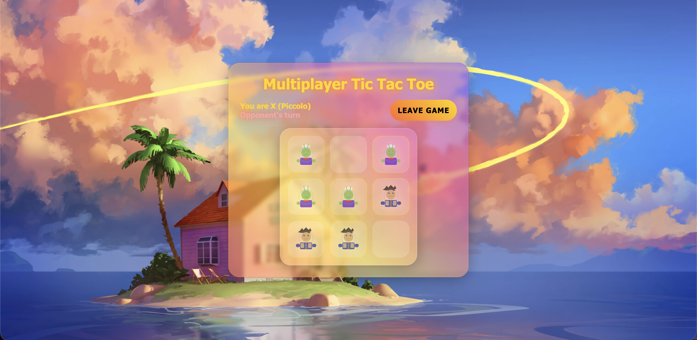

# Multiplayer Tic Tac Toe

A browser-based two-player Tic Tac Toe game using Node.js and Socket.io.



## Why I built this

I built this project to get hands-on with WebSockets and real-time system design in a practical, user-facing way.  
The main goal was to model bidirectional communication between two clients, keep shared game state synchronized with low latency, and enforce server-authoritative rules so both players always see a consistent match.

Using a multiplayer game as the testbed let me explore core real-time concepts end to end: connection lifecycle events, event-driven messaging, lobby orchestration, and fault handling for disconnect/reconnect scenarios.

## Project structure

- `public/` — served client files
  - `index.html` — game UI and lobby entry screen
  - `style.css` — styling for lobby, board, and modal
  - `script.js` — multiplayer browser logic
- `src/` — server source code
  - `server.js` — Node.js backend, lobby manager, and game logic
- `package.json` — dependencies and start script
- `README.md` — documentation

## Run locally

1. Install dependencies:

```bash
npm install
```

2. Start the server:

```bash
npm start
```

3. Open the browser at:

```text
http://localhost:3000
```

## Gameplay

- Users enter a lobby screen and can either create a new lobby or join one from the list.
- When two players are matched, the game starts and players are assigned `X` or `O`.
- Moves are validated on the server and broadcast to both players.
- If a player disconnects during an active game, the remaining player automatically wins.
- At game end, a modal prompts the player to return to the lobby.

## Notes

- The lobby list updates live as rooms are created and closed.
- Closing a browser tab removes that lobby or ends the current game.
- The server treats the remaining player as the winner when an opponent disconnects.
